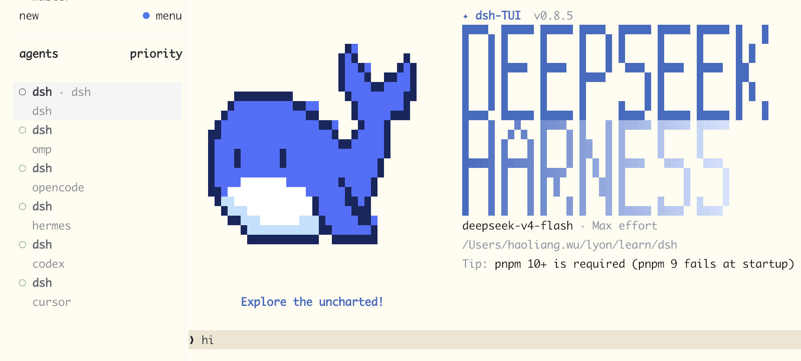

# dsh-herdr

A plugin that shows your [dsh](https://github.com/ccch1mneyyy/dsh-TUI) session in [Herdr](https://herdr.dev)'s agent panel — with a live `idle` / `working` / `blocked` status, so you can see what dsh is doing, and when it's stuck waiting for your approval, from anywhere in Herdr. It speaks the same pane-socket protocol as Herdr's own integrations (opencode, pi, omp), so there is zero Herdr-side configuration.



- **Tiny.** ~5 KB bundle (1.7 KB gzipped), zero dependencies — the built code only uses Node's `net` and `fs`.
- **Zero setup.** Uses the JSON-lines pane socket API Herdr's built-in integrations already use; no Herdr config, no extra daemon.
- **Human-meaningful states.** Only the pane's root agent is reported, so subagent churn never floods the panel; a pending approval shows as `blocked` with the reason.
- **Never blocks dsh.** Reports are fire-and-forget with 3 tries and a 3 s timeout — a missing or restarting Herdr can't stall your agent.
- **Survives restarts.** Report sequence numbers are seeded from the wall clock, so a restarted dsh is never dropped as stale.
- **Cleans up after itself.** On exit — including Ctrl+C — the plugin synchronously releases its pane authority, so no ghost `dsh` rows linger.

## Example

Run dsh inside a Herdr pane and the panel follows your session:

```sh
$ dsh --profile tui              # inside a Herdr pane
                                 # panel:  dsh ● idle
$ you: "deploy the api"          # agent starts working
                                 # panel:  dsh ● working
$ bash tool asks for approval    # panel:  dsh ● blocked — waiting for approval: bash
$ you approve                    # panel:  dsh ● working
```

## Getting started

**Prerequisites:** [dsh-TUI](https://github.com/ccch1mneyyy/dsh-TUI) `>= 0.8.5` with a `tui` profile, and a [Herdr](https://herdr.dev) pane to run dsh in.

```sh
# 1. add the plugin to your tui profile
dsh plugin --profile tui add /path/to/dsh-herdr

# 2. restart dsh inside a Herdr pane
# 3. open Herdr's agent panel — dsh appears with a live status
```

> **Dependency:** this plugin is built for `@deepseek-harness-tui/dsh-tui >= 0.8.5` and is a strict no-op outside a Herdr pane (or with other profiles).

To uninstall, remove the package from the profile's `dsh.profile.bundles` list.

## How it works

A process inside a Herdr pane inherits `HERDR_ENV`, `HERDR_PANE_ID`, `HERDR_BIN_PATH`, and `HERDR_SOCKET_PATH`. The plugin talks to the local Herdr socket with JSON-lines requests (`pane.report_agent`, `pane.release_agent`) — the same protocol Herdr's built-in integrations use.

Only the pane's root agent is reported:

| dsh signal                       | Herdr state |
| -------------------------------- | ----------- |
| plugin boot                      | `idle`      |
| `agent/status` → `running`       | `working`   |
| `agent/status` → `idle`          | `idle`      |
| session event `approval/asked`   | `blocked`   |
| session event `approval/decided` | prior state |

Every report carries the dsh session id (`agent_session_id`) once a session exists; on exit the plugin releases lifecycle authority (`pane.release_agent`), flushing synchronously so even hard exits reach Herdr.

Herdr accepts a source's reports only while their `seq` strictly increases and silently drops stale ones. The reporter seeds its per-source sequence from the wall clock at startup, so a restarted dsh never falls below the sequence a previous process already used.

## Development

```sh
bun install          # dev deps (types only)
bun run typecheck    # tsc --noEmit
bun run build        # bundle to dist/ (reinstall the profile after changes)
bun run smoke        # fake-Herdr-socket end-to-end test
```
